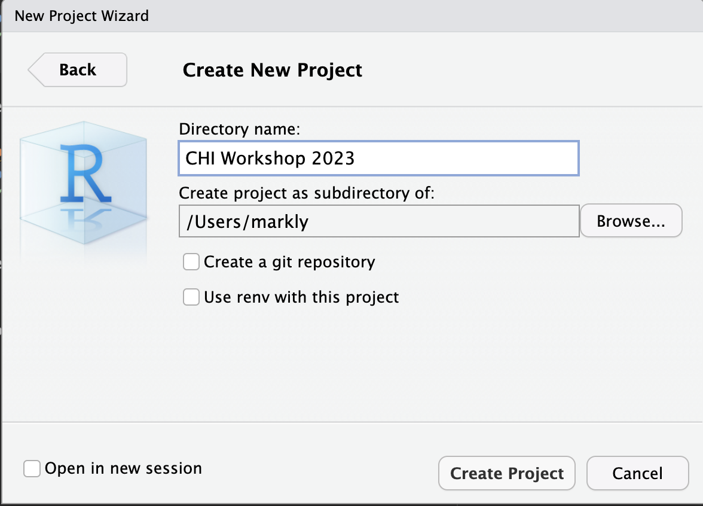

# R and R studio

**R** is programming language like Javascript, Python, Java, C and C++, that is mostly used for statistical computing and visualizations. 

**RStudio** is a integrated development environment (_IDE_) created to help organize and streamline your programming with R. 

There is a desktop version of RStudio, where you can download and work on a local environment or if you prefer, there is a cloud version where you can do cloud computing instead. 

Both the desktop and cloud version will be able to produce the same results and it really depends on your workstation capabilities, what types of scripts you are planning to run and, how often you are planning to use RStudio.

## Getting Started (Desktop)

### Installation

To get started we want to download both **R**, the programming language, and **R studio** the IDE.

You can get both from a quick Google search or from the website.

<https://posit.co/download/rstudio-desktop/>

```{r fig.cap=paste("Download screen for R and RStudio"), echo=FALSE}
knitr::include_graphics("images/2.1rdownload.png")
```
We want to install **R** before we install **RStudio**

Once you have downloaded both **R** and **RStudio** you can load up the **RStudio IDE** and it will come up with something like this.

```{r fig.cap=paste("RStudio IDE"), echo=FALSE}
knitr::include_graphics("images/2.3rstudio.png")
```

### Creating a Project

Every time we want to work on something new, we should make a `New Project` to keep things organized. This will be a folder where all your code and output will be stored. 

To create a new project we will go to `File -> New Project`

```{r fig.cap=paste("New"), echo=FALSE}
knitr::include_graphics("images/2.10newproject.png")
```

After selecting **New Project**, select **New Directory** and then select **New Project**. You will then get a window that lets you type in a directory name and allows you to select a location for this folder. 

```{r fig.cap=paste("Creating new project"), echo=FALSE}

knitr::include_graphics("images/2.12newproject2.png")

```


Once we created the new project folder, we can create a new folder in there to hold our data. This will be more clear when we start loading our datasets.

Now that everything is set up, we will start by making our first R-markdown file, which is a file format that allows you to write reports and as well with chunks of code. 

### Creating .RMD file

Now that we have created our new project and added our data to the folder, we can create our first **R Markdown** file by going to `File -> New File -> R Markdown`

**R Markdown** files are unique to R which is document that combines both text and code and allows you to format your document for HTML, PDF, MS Word. You can tell it is a **R Markdown** file when it has the extension **_.rmd_**

A popup window should come up and we need to title our **R Markdown** file.

You can type in **_2023 Rworkshop_** for the title and then click on ok to create the **_.rmd_** file. 

```{r fig.cap=paste("RStudio markdown creation"), echo=FALSE}
knitr::include_graphics("images/2.4rmarkdown.png")
```

Once you hit `OK`, you should see a tab at the top that says `Untitled1` and your **RStudio IDE** should have 4 distinct panels.

```{r fig.cap=paste("New .rmd file"), echo=FALSE}

```

1. **Source** - Places where most of the coding happens. The source can look different depending the type of file you are working with (.rmd, .R, .MD). Any dataset you want to view will also show up in this window. 

2. **Environment/History** - This is were you can find any stored variables (objects), imported scripts, loaded databases that are defined in memory. The history tab will contain a history of all the R commands that you have executed in this session

3. **Console/Terminal** - This is were the commands that are written in the source window are actually executed and started to run. This would be the same if you were to use R using a command line instead of an IDE. You can run and enter in commands and scripts in this window, but they will be executed as soon as you hit `ENTER/RETURN`. Can be used to quickly check a snip of code, do some basic calculations or install some packages. Runtime errors will also show up in this window which can be useful when you are debugging. 

4. **Files/Plots/Pkgs/Help/Viewer** - This is more a directory window where you can cycle between files, plots, packages, help, and Viewer. 

## Getting Started (Cloud)

If you would like to use the cloud version of **RStudio** you can sign up for the free version here:

<https://posit.cloud/plans/free>

```{r fig.cap=paste("Sign up for RStudio cloud"), echo=FALSE}

```

If you are just planning to use R occasionally and don't need heavy computing, then the free version of RStudio cloud will work just fine. 

### Creating .RMD File

After logging in to the free account, you can click on `New Project` on the right hand side and select `New RStudio Project` 

```{r fig.cap=paste("RStudio Cloud Creating a new project"), echo=FALSE}
knitr::include_graphics("images/2.6rmarkdowncloud.png")
```

Once you open the new project, you will get a screen similar to this. 

```{r fig.cap=paste("RStudio Cloud Creating a new project"), echo=FALSE}

```

From here we want create a **R Markdown** file by going to `File -> New File -> R Markdown`

```{r fig.cap=paste("RStudio Cloud new markdown file"), echo=FALSE}
knitr::include_graphics("images/2.8rmarkdowncloudnew.png")
```

A pop-up will appear saying it will need to install some packages to create a **R Markdown** file. You can install these by selecting `Yes`

```{r fig.cap=paste("RStudio cloud markdown packages"), echo=FALSE}
knitr::include_graphics("images/2.9rmarkdownpackages.png")
```

Another popup window should come up and we need to title our **R Markdown** file.

You can type in **_2023 Rworkshop_** for the title and then click on ok to create the **_.rmd_** file. 

```{r fig.cap=paste("RStudio cloud markdown name"), echo=FALSE}
knitr::include_graphics("images/2.4rmarkdown.png")
```

Once you hit `OK`, you should see a tab at the top that says `Untitled1` and your **RStudio IDE** should have 4 distinct panels. 

The panels are the same as the ones described in [Getting Started (Desktop)]
