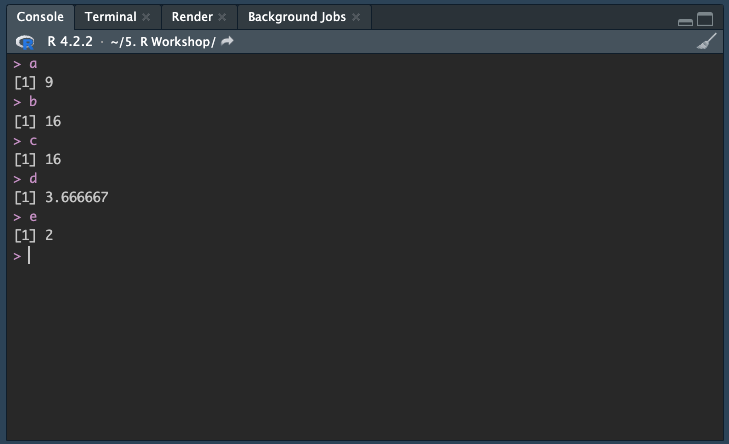

# Basics

Now that we set-up our **R Markdown** file we can start exploring what we can do with **R** 

The examples will be shown on **R Desktop** but will work the same if you are using **R Cloud**.

In this section, we will learn about some simple coding operations you can perform with **R**, learn about different data types and, how to create and manipulate variables.

## Basic Operations

All the basic arithmetic operators can be done in using **R** which includes

* Addition: `+`
* Subtraction: `-`
* Multiplication: `*`
* Division: `/`
* Exponentiation: `^`
* Modulo: `%%`

Modulo is an operation that will return the remainder of the division. For example;

$$
11 \bmod 4 = 3
$$
This is because 11 divides by 4 (twice) and you are left with 3 remaining. 
$$
25 \bmod 5 = 0
$$
Alternatively, 25 divides into 5 evenly into 5 so you are left with no remainder.

<h2> Try </h2>

> You can try out the following operations in the **Console** window in R studio.

```{r basic arthimatic,results='hide'}
4 + 5
24 - 8
4 * 4
11 / 3
11 %% 3
```

Alternatively, we can use our **R Markdown** file we created to do these operations as well. 

## Code Chunk

To use the **R Markdown** file we will need to create a **_Code Chunk_**. For **R Markdown** files, each line outside of a code chunk will be text. To execute and run your code, it will need to be inside a code chunk.

To create a code chunk you can go to the top and find `Code` and then click on `Insert Chunk`. 

<h3> NOTE </h3>

For Mac users the shortcut for inserting a code chunk is:

> `Command + Option + i`

For Windows users the shortcut for inserting a code chunk is:

> `Ctrl + Alt + i`

<h2> Try </h2>

>Try to create a code chunk using either the menu at the top to insert or keyboard shortcuts in the source window where your *R Markdown* file is. You should see a new section appear like the image below

```{r fig.cap=paste("RStudio code chunk"), fig.width=5, fig.height=5, echo=FALSE}

```
You we can re-run the same operations from before in this code chunk instead of running it in the console. When you are ready, you can click on the green arrow at the top right of the code chunk to execute the entire chunk. The answers will be evaluated in order right beneath the code chunk. 

<h2> Try </h2>

>Try running the same equations as before but this time in the code chunk. Use the green arrow on the top right of code chunk to evaluate all the equations in the chunk.

```{r fig.cap=paste("RStudio code chunk evaluated"), fig.width=5, fig.height=5, echo=FALSE}

```


## Storing Variables

We can use the code chunk to help us store variables we might want to reuse later on instead of having to type it out each time.

To assign a value of 8 to the variable `var1`, you can use the following commands

> var1 <- 8 

or

> var1 = 8

<h2> Try </h2>

> Create a new code chunk and try storing our previous results to the variables a-e

```{r basic arthimatic variables, results='hide'}
a <- 4 + 5
b <- 24 - 8
c <- 4 * 4
d <- 11 / 3
e <- 11 %% 3
```

> Note: When you assign a variable, RStudio will store it in the environment panel. 

```{r fig.cap=paste("Updated environemnt"), fig.width=5, fig.height=5, echo=FALSE}

```
Once your variable is assigned you can recall the result by calling the variable. We can use the use these variables directly in the console or together in the *R Markdown* file.

<h2> Try </h2>

> Try recalling the new variables in both the **console** and in a **code chunk**. Create another new code chunk and just type in the variable name. Click on the green arrow when you are ready to evaluate

```{r fig.cap=paste("Using variables console"), fig.width=5, fig.height=5, echo=FALSE}

```

## Using Variables

We can also perform the same mathematical operations using stored variables instead of needing to write out.

<h2> Try </h2>

> Using a **code chunk** or just in the **console**, perform the following operations.

```{r basic arthimatic stored, results='hide'}
a + a
b - c
a * d
b %% c
```

## Logical operators 

**R** can also perform logical operations as well that include

* Less than: `<`

* Less than or equal to: `<=`

* Greater than: `>`

* Greater than or equal to: `>=`

* Exactly Equal to: `==`

* Not equal to: `!=` 

* OR: `|`

* AND: `&`

In any type of programming you do, you will likely run into these logical operations. You will commonly see these types of operators when we are cleaning and preparing data sets for analysis. For health data, we can use logical operators to help us determine disease status or help us separate age groups. 

<h2> Try </h2>

>Try using the following logical operators on the variables that we created in the *console* or in a *code chunk*

```{r logic operators, results='hide'}
a > b
b == c
e <= b
```

## Data types

There are different data types you will run into while you are working on a data set including

* **Numeric**: All real numbers with or without decimals `8.4`

* **Integers**: Whole numbers `29`

* **Logical**: Boolean values `TRUE or FALSE`

* **Characters**: Characters or String values. A single letter is a character `A`. A word or a sentence would be a string `Orange`

It is important to know the data type you are working with since some of the common mistakes in cleaning and working with a data set is trying to combine data types that are not compatible. 


<h2> Try </h2>

>Let's create a new code chunk and create one of each variable time and try to perform some arithmetic operations on them to see what happens.

<h3> Note </h3>

> Logical variables: The proper syntax is all caps TRUE or FALSE

> Characters: For strings and characters, you need to surround the word or the letter with single or double quotations. "Apple" "Orange" 'Cat'

```{r data types, results='hide'}
new_num <- 8.4

new_int <- 29

new_logi <- TRUE

new_stringA <- "R Workshop"

new_stringB <- "2023"

```

<h3> Note </h3>

> A quick way to check what type of variable you are dealing with is to use the class function. i.e., class(new_num)


```{r combining data types, results='hide'}
new_num + new_int

new_stringA == new_stringB
```

To combine strings together we want to use the `paste()` function

```{r combining strings, results='hide'}
paste(new_stringA, new_stringB)
```

