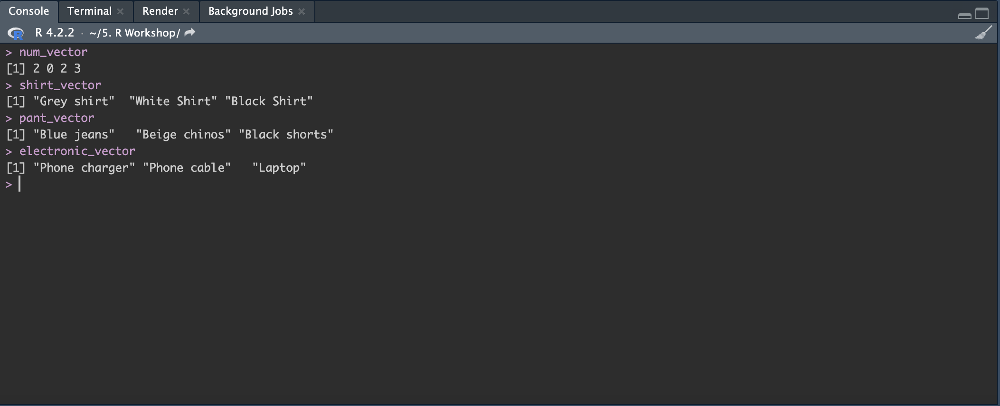
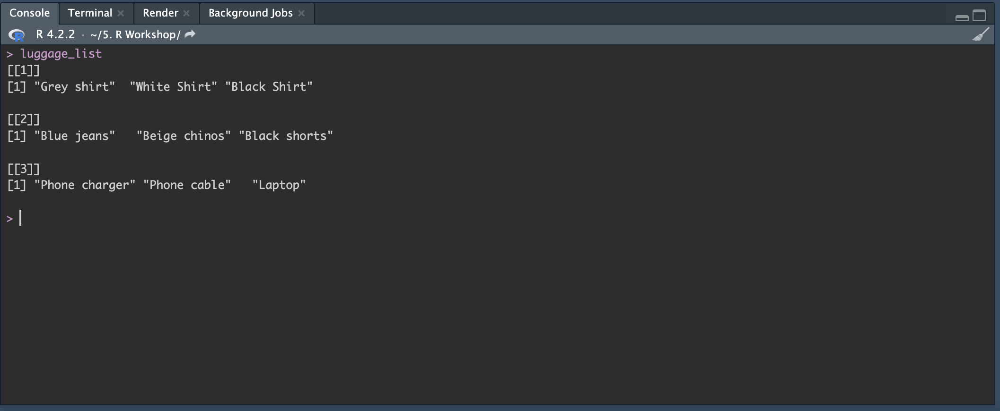
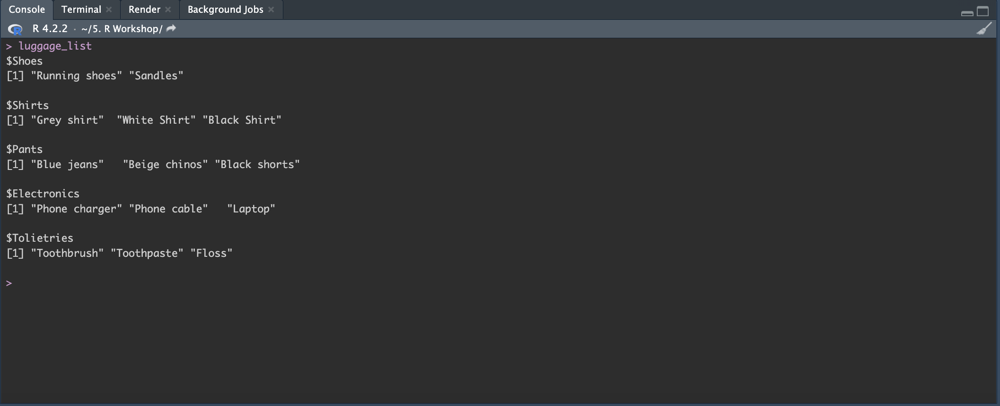
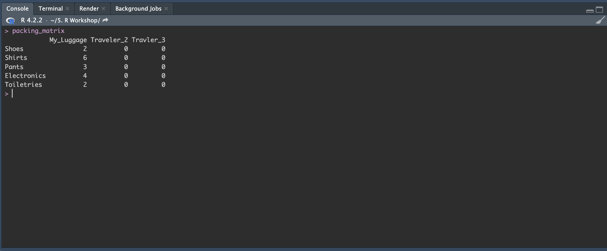
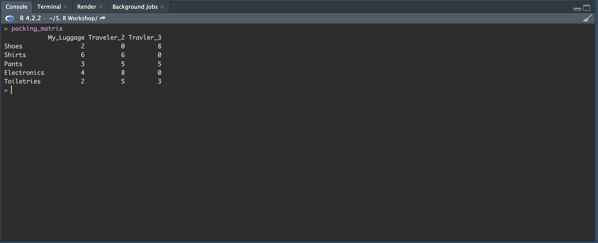

# Data Structures

So far we've learned some basics of what you can do in *R* and *R Studio* including the creation and storage of variables. When processing data sets, we need to use data structures for processing, retrieving and storing data. These data structures are 

* **Vectors**: Elements of the same type

* **Lists**: Contains elements of different types. Can contain store numerical values, strings and characters all together.

* **Matrices**: arranged in a 2d layout with rows and columns. s

* **Data frames**: a 2d table-like structure where each column can have a different data type.

* **Factors**: Used to categorize the data and store it in levels. 


## Vectors

This is a one dimensional data structure where all the elements in the vector are the same. Similar to vectors that are found in mathematics.

Imagine that you're going on a vacation and you need to pack all the essentials in your luggage. To make most space you want to use packing cubes and pack all your similar items together. So all your shirts go in one cube, all your pant in another and, all your electric devices in the third one. You can think of your packing cube as a vector in R, and the items you're packing as the elements of the vector.

### Creating simple vectors

<h2> Try </h2>

> Try creating a vector using the **c( )** function. 

```{r basic vectors, results='hide'}
num_vector <- c(2,0,2,3)

shirt_vector <- c("Grey shirt","White Shirt","Black Shirt")

pant_vector <- c("Blue jeans", "Beige chinos", "Black shorts")

electronic_vector <-c("Phone charger", "Phone cable", "Laptop")

```

```{r fig.cap=paste("Basic Vectors"), fig.width=5, fig.height=5, echo=FALSE}

```

### Simple vector operations

One thing that's unique about vectors in R is that you can perform operations on them all at once. Because of your organized packing you are able to double the number of shirts you can pack. If **num_vector** represents the number of each shirt, you can simply multiply this by 2 and you can increase the number of shirts you are bringing with you. 

<h2> Try </h2>

> Try doubling the **num_vector** variable you created. Also, try to see what happens when you try to double the **shirt_vector**.

## Lists 

A list in R is like a container that can hold any type of data. So in this case, your luggage will be a list because it used to hold all the the different items together (shirts, pants, electronics). We will have a luggage list which contains a shirt vector, a pant vector and electronic vector. 

### Creating a list of vectors

<h2> Try </h2>

> Try to make the luggage list with the our previous vectors by using the **list( )** function


```{r basic list, results='hide'}
luggage_list <- list(shirt_vector, pant_vector,electronic_vector)
```

```{r fig.cap=paste("Basic Lists"), fig.width=5, fig.height=5, echo=FALSE}

```

### Accessing elements in the list

Notice the output we get when we call our list. Our shirts are the first item in our list, pants the second and electronics the third. If you want to check what **jeans** you packed in your luggage list, you can use **luggage_list[[2]]**

<h2> Try </h2>

Try accessing the pants section in our luggage list.

### Adding items to lists 

#### Add to the end 

Let's say you need to add another packing cube but this time it has all your toiletries. To do this you need try the following:

```{r add to end of list, results='hide'}
luggage_list[[length(luggage_list)+1]] <- c("Toothbrush", "Toothpaste","Floss")
```

If we were to check our list again, we can see that our new toiletry vector has been added to the end of the list.
 
#### Add to the front

We still have a little bit of space in our luggage and decide to pack some shoes. If we want to add shoes to the front our list try the following

```{r add to start of list, results='hide'}

shoes_vector <- c("Running shoes","Sandles")

luggage_list <- c(list(shoes_vector), luggage_list)
```

<h2> Try </h2>

> Try adding toiletries vector to the end of the list and the shoes vector to the front of our luggage list using the code provided above. 


Your luggage list should now have shoes, shirts, jeans, electronics and toiletries.

### Labeling items within lists

Now that our list has grown, we should label each item incase we forget the of our items. To rename the items in the list you can use the **names( )** function.


```{r rename lists, results='hide'}
names(luggage_list) <- c("Shoes","Shirts","Pants","Electronics","Tolietries")
```

Now we can we can access our items by using the **$** symbol which make it easier to check what lists we have. 

<h2> Try </h2>

> Try accessing the **Electronics** vector in our luggage_list using the **$** Symbol. 

```{r fig.cap=paste("Basic Lists"), fig.width=5, fig.height=5, echo=FALSE}

```

We have created a **luggage_list** that has 5 vectors that are labeled shoes, shirts, pants, electronics and toiletries.

## Matrices 

A matrix is a 2d data structure that contains rows and columns. Matrices can **only** contain elements of the same data type, so all the elements in the matrix must be either numeric, character, or logical. Matrices are useful for organizing and manipulating data in a structure and efficient manner since we are able to perform mathematic operations on them, like linear algebra. 

In our current example, we can consider a matrix as a packing checklist where each row represents a particular item to pack (such as shirts, pants, or shoes) and each column represents a each of our travel partners luggage. The elements of the matrix could then represent the quantity of each item to pack in each suitcase

### Creating a matrix

We can generate a matrix using the **matrix( )** function

```{r basic matrix}
packing_matrix <- matrix(0,nrow = 5, ncol=3)

rownames(packing_matrix) <- c("Shoes", "Shirts", "Pants", "Electronics", "Toiletries")

colnames(packing_matrix) <- c("My_Luggage", "Traveler_2", "Traveler_3")

print(packing_matrix)
```
<h2> Try </h2>

> Try creating a packing matrix using the code provided above

### Navigating the matrix

#### Filling in values

Now that we have created our matrix, we can access certain columns and rows by indexing which is done using square brackets **[ ]**. The synatax for using square brackets would be **matrix[row,column]**. Currently, we have no values in our matrix but we can fill them using indexing. 

Let's say you ended up packing 2 shoes, 6 shirts, 3 pants, 4 electronics, and 2 toiletries. To add this to your matrix, you would create a vector and then pass that vector into the first column using the indexing syntax

```{r adding values, results='hide'}
packing_matrix[, 1] <- c(2, 6, 3, 4, 2)
```

Now when check our matrix we should have the first column filled out with the number of items that we packed. 

```{r fig.cap=paste("Matrix filled"), fig.width=5, fig.height=5, echo=FALSE}

```

<h2> Try </h2>

> Try filling putting values for Traveler_2 and Traveler_3. You can select them yourself or just generate them randomly. 

<h3> Note </h3>

> To randomly generate some numbers we can use the sample( ) function.

> i.e., sample(1:8, 5, replace = TRUE)

```{r filling in values, results='hide'}
packing_matrix[,2] <- sample(1:8, 5, replace = TRUE)
packing_matrix[,3] <- sample(1:8, 5, replace = TRUE)
```

Now that our have filled our packing matrix, we can easily showcase how to access columns and rows in a matrix. 

```{r fig.cap=paste("Matrix full"), fig.width=5, fig.height=5, echo=FALSE}

```

#### Selecting columns

Let's say we want to double check all the things that were packed for myself. To index a column of a matrix you simply have to use the square brackets. Since we know we are the first column in the matrix we can use **packing_matrix[,1]** to find out what we packed.  

```{r First column in matrix}
packing_matrix[,1]
```

<h2> Try </h2>

> Try see what Traveler_2 and Traveler_3 packed

#### Selecting rows

Let's say we are curious on how many shirts each person going on this trip packed. We will still use square brackets, but this time we will be indexing the row instead of the column. **packing_matrix[2,]**

```{r First row in matrix}
packing_matrix[2,]
```

#### Multiple selections 

If we want to see how our packing compares to our travelling partners packing we can use a vector to index 2 columns at the same time. 

```{r Two column}
packing_matrix[,c(1,3)]
```
We can also index a certain range instead of selecting specific rows or columns. Let's say we want to check the what each person packed for shoes, shirts and pants. We could index using a `vector` by putting all 3 numbers or we can use a `colon` **:** to check the range. 

```{r First 3 rows}
packing_matrix[1:3,]
```

## Dataframes

Dataframes is a very popular data structure in R since they are easy to work with and allows you do organize and work with data very efficiently. A dataframe is another tabular object like the matrix but the difference between the two is that you can store different types of data in a dataframe. Think of it similar to an excel spreadsheet where you can different types of data for each column (age, gender, income, etc.). 

### Creating a dataframe

So with our vacation example, we can use a dataframe to keep track of the preferences of each traveler with the following variables.

* Age (numerical)

* Gender (factor)

* Budget (numerical)

* Number of luggages (numerical)

* Weight of luggages (numerical)

* Food allergies (string)

* Activities (string)

* Must see places (string)

<h3> Note </h3> 

> To create a dataframe you can use the function **data.frame( )**

```{r travelers dataframe}
travelers <- data.frame(
  Age = c(25, 30, 35),
  Gender = factor(c("Female", "Male", "Non-binary"), levels = c("Male", "Female", "Non-binary")),
  Budget = c(1500, 2500, 2000),
  Num_luggages = c(2, 3, 1),
  Weight_luggages = c(20, 15, 25),
  Food_allergies = c("Peanuts, shellfish", "Gluten, dairy", "None"),
  Activities = c("Hiking, sightseeing", "Museums, beach", "Shopping, nightlife"),
  Must_see_places = c("Eiffel Tower, Colosseum", "Statue of Liberty, Grand Canyon", "Golden Gate Bridge, Machu Picchu")
)

print(travelers)
```

### Using a dataframe

#### Manipulating data 

Like spreadsheets, we can manipulate the dataframe to create new variables. If we wanted to find out the average weight of the luggages we can use build in mean function

```{r average weight}
mean(travelers$Weight_luggages)
```

We can also find the median as well using the median function

```{r median weight}
median(travelers$Weight_luggages)
```

#### Subsetting data 

If we don't want all the columns, we can subset what we need into a new dataframe using square brackets **df[row,col]**. If we wanted to to look **Age**, **Gender** and, **Budget** we can use the following code.

<h3> Note: </h3>

> This is using base R, we will be using a package later on called 'dplyr' to also subset the data

```{r subset base R}
travelers[,1:3]
```

<h3> Note: </h3>

> If we didn't know the names the columns we can use the **names( )** function to find out the column names. 

> If we knew the names, we can also subset using a vector and the names of the columns we want to subset **travelers[,c("Age","Gender","Budget")]**

#### Filtering data

Let's say that we are only interested in those who have a budget that is **< 2500**. We can use the logical statements that were introduced in Chapter 3 to do this.

```{r subset budget R}
travelers[travelers$Budget <2500, ]
```

<h2> Try </h2>

> Try to subset the dataframe for **Age > 25** 

```{r subset age R}
travelers[travelers$Age >25, ]
```

## Factors

Factors are used to represent categorical variables such as **Gender** or **Income levels**. Using the *factor( )* function, we can change text data types to factor data types and use built in-functions to work with categorical data. 

You may have noticed before when we created our travel dataframe that gender was coded using the *factor( )* 

```{r factor gender}
factor(c("Female", "Male", "Non-binary"), levels = c("Male", "Female", "Non-binary"))
```

we can use the table function to show us the number observations in each category. 

```{r table on factor}
table(travelers$Gender)
```

the *levels( )* function will show the order of our categorical variable. In our **travelers** dataframe, we set the levels as **Male, Female, Non-binary**. If want to know the integer representation we can use the **as.numeric( )** function to show us the order. In our example, the first traveler is **"Female"**, second is **"Male"** and, third is **"Non-binary"**. 

```{r order of factor}
as.numeric(travelers$Gender)
```

