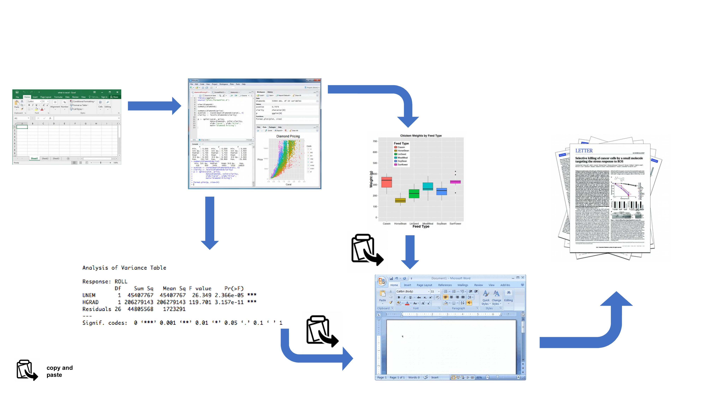
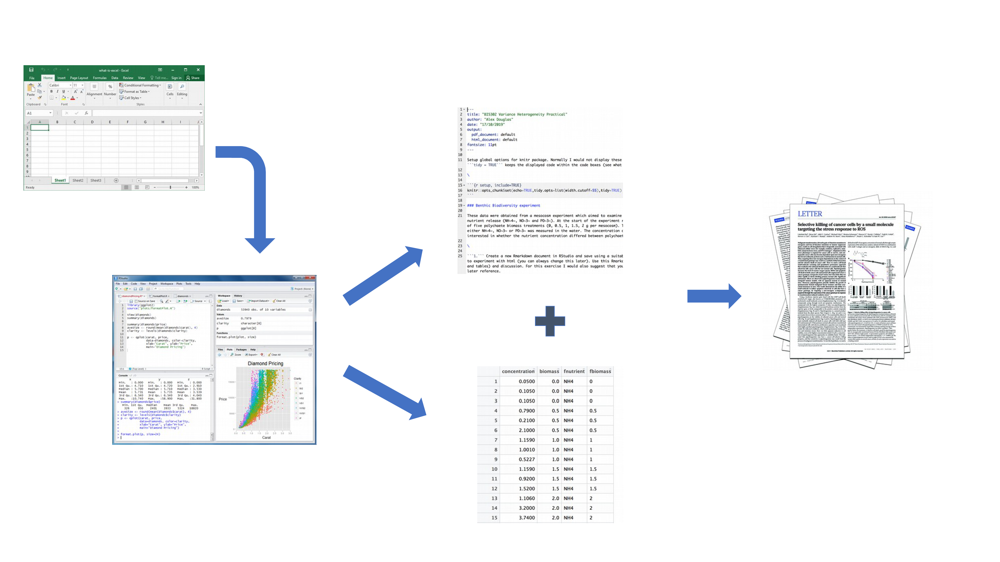
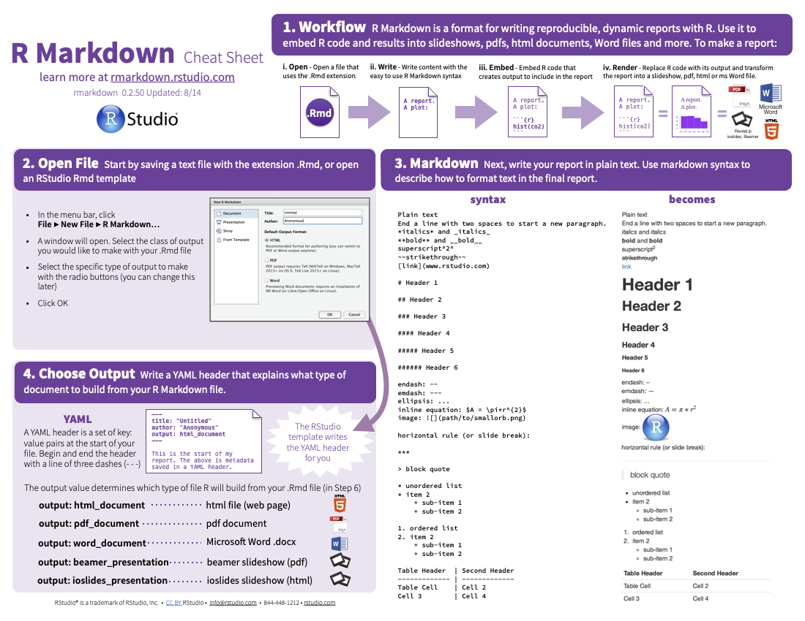
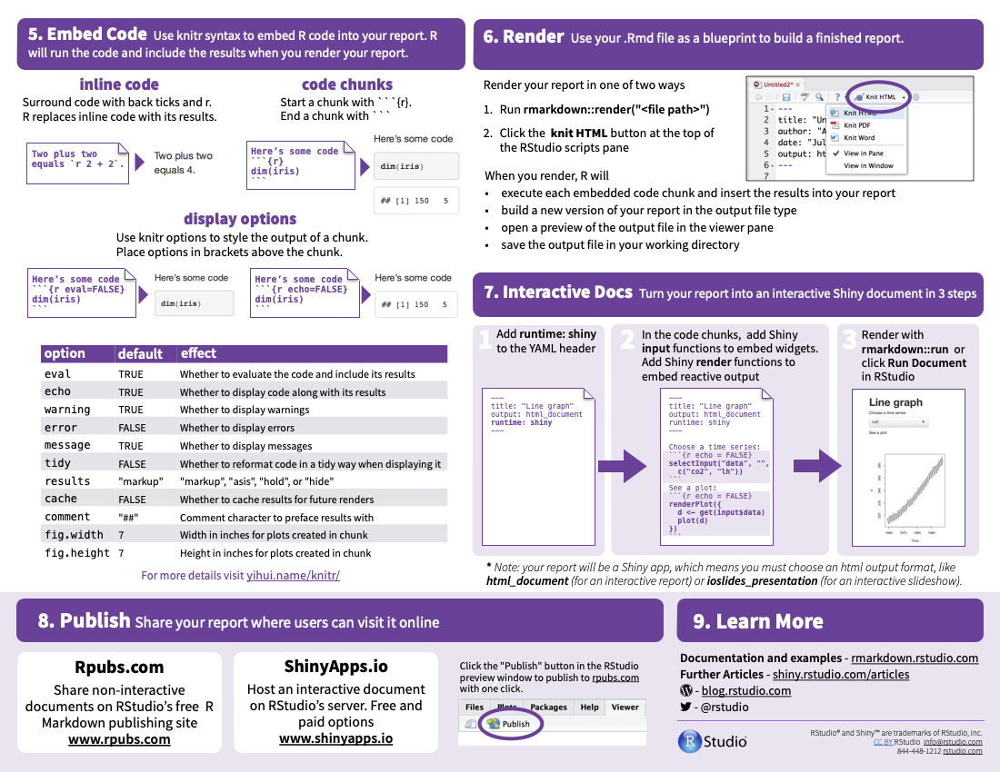
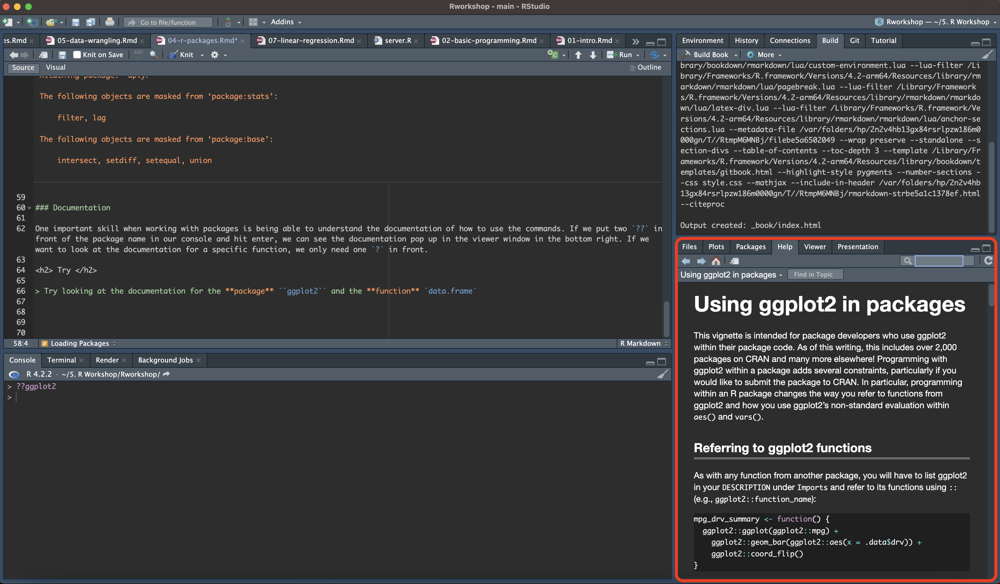

# R Packages

## R Packages

Packages are a collection of functions that extend the functionality of R. They are tools that help with data analysis, modelling, data visualization.  Some of the most common packages in R is **ggplot2** for data visualization, **dplyr** for data wrangling/manipulation and **caret** for machine learning. 

### Installing Packages

To use packages we will have the the **install.packages( )** function and put in the package. We can either does this as a _chunk_ in a R-markdown file or we can type it directly into the console. To install a package, we will need to write the name of the package we want to install surrounded by quotes. `install.packages('package name')`

<h2> Try </h2>

> Try installing **dplyr**, **ggplot2**, and **tinytex** packages


<h3> Note </h3>

> You can install multiple packages are the same time if you put then in a vector and before using the **install.packages( )** function.

> i.e., install.packages(c('dplyr','ggplot2','tinytex'))


## R markdown

One advantage to using R-studio is the ability to output reports into as a word, html, or pdf format. Using the **knit** function capabilities, we can create reports that can be easily reproduced since the code and outputs are all in the same R-markdown file. This is an advantage if you need to generate reports if data gets updated. 

### Installing R Markdown

Just like above, we want to install our package using `install.packages( )` function 

<h2> Try </h2>

> Try installing **rmarkdown**

### Why R Markdown

As we've been using throughout day 1, R markdown files are convenient because we can execute and display our code in line. In day 2 we will use this to generate a report after some data analysis. R markdown files are great at organizing your workflow. Here is a image from Intro to R book by Alex Douglas, Deon Roos, Francesca Mancini, Ana Couto & David Lusseau. <https://intro2r.com/>

```{r fig.cap=paste("Work flow"), fig.width=5, fig.height=5, echo=FALSE}

```

By working with R studio environment, we can simplify the workflow by performing the analysis, creating the figures and results, and writing the report all in one place. If adjustments to the report need to made, we can quickly regenerate the report using in a R markdown file.

```{r fig.cap=paste("Work flow with R"), fig.width=5, fig.height=5, echo=FALSE}

```

R markdown files can also handle other formats including LaTex, html, and css which can help us format our final report. There are r markdown cheat sheets available online to quickly find commands for formatting your report. 

```{r fig.cap=paste("Markdown cheatsheet"), fig.width=5, fig.height=5, echo=FALSE}

``` 

```{r fig.cap=paste("Markdown cheatsheet page 2"), fig.width=5, fig.height=5, echo=FALSE}

``` 

### Using Packages

#### Loading Packages

After installing our packages, we have to load them using the **library( )** function or the **require( )** function. This is similar to opening up a new app or program that you just installed. 

<h2> Try </h2>

> Try loading the 3 packages that we just installed (**dplyr**, **ggplot2**, and **tinytex**)

```{r loading packages, results='hide', warning= FALSE}
library(dplyr)
library(tinytex)
library(ggplot2)
```

### Documentation

One important skill when working with packages is being able to understand the documentation of how to use the commands. If we put two `??` in front of the package name in our console and hit enter, we can see the documentation pop up in the viewer window in the bottom right. If we want to look at the documentation for a specific function, we only need one `?` in front. 

<h2> Try </h2>

> Try looking at the documentation for the **package** ``ggplot2`` and the **function** `data.frame`


```{r fig.cap=paste("Documentation window"), fig.width=5, fig.height=5, echo=FALSE}

```


