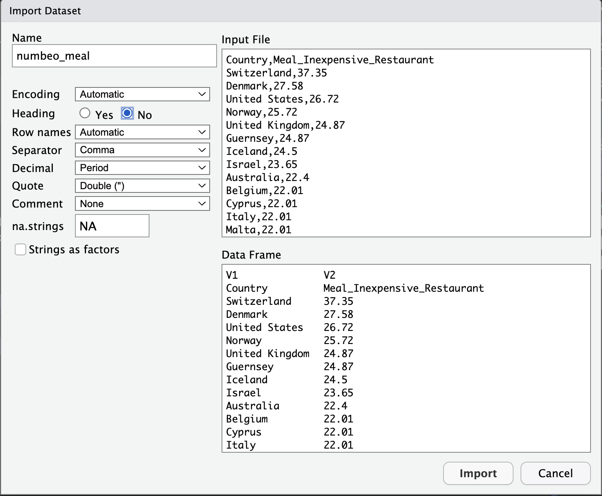

# Data Wrangling


Our goal is to generate a report with using a R-markdown file that includes some data analysis and data visualizations. We are going to use the travelers dataframe that we created yesterday as a starting point but will incorporate other datasets as we continue throughout the day. 
Let's create a new R markdown file and called it `travelers`. We want to install and load the packages that we introduced yesterday. We will be adding a few packages as we go throughout the day.

* dplyr

* ggplot2

Let's also create our travelers dataframe from yesterday

```{r travelers2 dataframe}
travelers <- data.frame(
  Age = c(25, 30, 35),
  Gender = factor(c("Female", "Male", "Non-binary"), levels = c("Male", "Female", "Non-binary")),
  Budget = c(1500, 2500, 2000),
  Num_luggages = c(2, 3, 1),
  Weight_luggages = c(20, 15, 25),
  Food_allergies = c("Peanuts, shellfish", "Gluten, dairy", "None"),
  Activities = c("Hiking, sightseeing", "Museums, beach", "Shopping, nightlife"),
  Must_see_places = c("Eiffel Tower, Colosseum", "Statue of Liberty, Grand Canyon", "Golden Gate Bridge, Machu Picchu")
)
```

Next, we will be perform some data wrangling. Data wrangling refers to the process of gathering, cleaning, transforming, and organizing raw data into a format that is suitable for analysis or further processing. We will be using the `dplyr` package we installed in the previous chapter to do this. 

## dplyr

The **dplyr** is used for data manipulation and can allow us to work with data more efficiently than with base R. We can do the same operations in our previous _travelers_ dataframe using **dplyr**. 

### Pipe function (%>%)

This is one of the most powerful functions in the **dplyr** package. What the pipe function does is takes the output of one function and then passes it along to the next one. So instead of saving results to multiple variables, we can perform a sequence of commands in as one command. Using our previous **travelers** dataframe, we were able to calculate the *mean luggage weight* for all travelers but what if we are interested in the total weight of the luggage each traveler is bringing? We can do this in **dplyr** using the pipe function (%>%) and **mutate( )** function, which creates a new column. We can also subset the data as in the same function as well. Let's say we are only interested in all the numerical values, we can use the **select** function to ask it to select all the columns that hold numerical data. 

```{r dplyr mean weight}
travelers %>%
  mutate(mean_weight = Weight_luggages/Num_luggages) %>%
  select(c(where(is.numeric)))
```

You can see our new column **mean_weight** added to the end and that the dataframe only contains numerical values. If we were to do this without the pipe function, we would first need to get add the **mean_weight** column, save it, then subset our data for all numeric values including our new column. 

Lets say we want to filter our data finding travelers with a **age >25** or if they have a **budget >2500**. We can do this all together in one command using dplyr using the **filter( )** command. 

```{r dplyr filtering}
travelers %>% 
  filter(Age > 25 | Budget > 2500)
```

<h3> Note </h3>

> The _|_ is the logical statment **OR** in R. _&_ is the logical statment for **AND**

We can see that we have 2 entries that are either **Age >25** or have a **Budget >2500**

There are a lot more functions that are part of dplyr package. The most common ones for data manipulation are 

* **mutate( )** - Adds a new variable to your dataframe based on existing variables

* **select( )** - Picks variables from a dataframe based on their names

* **filter( )** - Picks out cases based on criteria

* **summarise( )** - Reduces down values down to a single summary

* **arrange( )** - Changes the order of the rows based 

For more information or more practice you can go to the `dplyr` website which also has a online book on data transformation. 

<https://dplyr.tidyverse.org/>

## Loading datasets

More often than not, we will be working with a datasets instead of creating our own. In **R** we can load the different types of files, the most common being a comma separated file (**CSV**). Now that we have our travelers preferences and budget we need to find a destination that would be suitable for each of our travelers. We will be using a few datasets from **Numbeo.com** and **The World bank**. 

We want to save these as variables so we can access them later.

To load a dataset, we will use the **read.csv( )** function and save the dataset as a variable in our environment. The first one we want to load is from **numbeo.com** which shows us the cost of a inexpensive meal at a restaurant. 

<h3> Note </h3>

> The data from **numbeo.com** is aggregated by user submissions and calculates the average costs of certain products


```{r loading dataset meals, results='hide'}
meals <- read.csv("data/numbeo_meal.csv")
```

Another way to load your data is using the import function in R studio. 

```{r fig.cap=paste("import function"), fig.width=5, fig.height=5, echo=FALSE}

```

When you select the file you want to import a window will appear and you can do some quick modification to our data if needed. 

```{r fig.cap=paste("import window"), fig.width=5, fig.height=5, echo=FALSE}

```

<h3> Note </h3>

>  One of the most common issues when using this feature is the setting the headers. There is a radial button for the header which you can toggle on and off. 

<h2> Try </h2>

> We will be making use of the ticket, arrivals and, country codes dataset. You can try loading these files with the interface or using a code chunk. 

```{r loading all datasets, results='hide'}
ticket <- read.csv("data/numbeo_ticket.csv")
arrival <- read.csv("data/world_bank_arrival.csv")
country_codes <- read.csv("data/country_codes_iso.csv")
```

## Understanding your dataset

Knowing what your dataset contains is important when performing data analysis. The more familiar you are with the shape of your dataset, the more insights you are able to pull out from it. This includes knowing the number of rows and columns as well as the types of columns that you are working with.

We can use the **View( )** function in order to open up a new tab to view the dataset like an excel sheet. 

<h3> Note </h3>

> This function is case sensitive and must be called with a uppercase **V**

```{r view function, results='hide', eval=FALSE}
View(meals)
```

To quickly look at the first 6 rows of the data we can use the **head( )** function.

```{r head function}
head(meals,3)
```

<h3> Note </h3>

> You can specify the number of rows you want to examine by adding the number to function

> i.e., **head(meals,4)**

You can also view the last rows of the column using the **tail( )** function

```{r tail function}
tail(meals,3)
```

We can do some quick summary statistics using the **summary( )** function as well. Depending on the type of data in each column, we can see the length or a number summary including the min, max, mean, median, mode, and the 1st and 3rd quartiles. 

```{r summary of meals}
summary(meals)
```

## Combining your dataset

Currently, we have 4 separate datasets that contain all the information we need. Our goal is to combine all the dataset to a singular one which we can start our data analysis. To do this need something that is unique for all the entries. In our case, the ISO country code and the country name are something that is unique for each entry.

We will be using the `country_codes dataset` as our base. 

### Binds

There are different types of ways to join your dataset depending on your desired outcome. Sometimes we just need to add columns or rows to the base dataset. For this, we can use either **rbind( )** or **cbind( )** if the conditions are appropriate. 

* **rbind( )** - row bind will add rows to the base dataset if they number of rows and the row names are the same. 

* **cbind( )** - column bind will add more columns to the base dataset if the they have the same number of rows. 


### Joins

Most times, we will have an unequal amount of rows or columns and we want to match with something unique to eaach row. For this we can utilize joins. There are different types of joins you can use that all perform their task differently. 

* **left_join( )** - Matches all paired variables to the left dataframe 

* **right_join( )** - Matches all paired variables to the right dataframe 

* **inner_join( )** - Returns a dataframe with only matching variables. If their is no matching variable, it does not get included.

* **full_join( )** - Keeps all variables from both dataframes even if they do not match. 


```{r fig.cap=paste("Types of Joins"), fig.width=5, fig.height=5, echo=FALSE}

```

<h3> Note </h3>

> left_join() is the most common join you will be using during a data analysis

Let's try to combine all 4 datasets into one working dataset. First we want to combine our *meal* and *ticket* dataframes since they have the same number of rows. We will use a *left_join( )* to combine these based on the country name. 

<h2> Try </h2>

> Try to perform a *left_join( )* on the *meal* and *ticket* based on *Country* name. 

```{r left join with meals and tickets}
travel_meal_tickets <- left_join(meals,ticket,by = "Country")
head(travel_meal_tickets,3)
```

Using a left join, we now have a single dataframe with 3 columns, Country name, the price for the restaurants and price for a one way ticket. 

Next, lets combine this dataframe with the country codes dataframe. Looking at the **country code** dataframe, we have 4 columns and 249 rows. We do need some cleaning on this dataframe before continuing. Let's keep the Country column and just the 3 digit alpha code using **dplyr** and the **select( )** function

```{r subset}
country_code_subset <- country_codes %>%
  select(c(Country,alpha_3_code)) %>%
  rename(country_code = alpha_3_code)

head(country_code_subset,3)
```

We want to use our new subset of the country_codes as our base model and join the meal/ticket dataframe to this one. Since the country code has 249 rows and the meal/ticket one has 105 rows. We want to use a full join here because we aren't sure of the country names are spelled the same in each dataframes.

```{r full join table}
country_ticket_meal_code <- full_join(country_code_subset,travel_meal_tickets, by = "Country")

head(country_ticket_meal_code,3)
```

Using the **filter( )** function, we can filter out which alpha_3_codes are missing and we notice there is just one which is Kosovo. 

```{r missing country codes}
country_ticket_meal_code %>%
  filter(is.na(country_code))
```


<h3> Note </h3>

> Kosovo is not country recognized by ISO 3166 standards. 

Finally, we want to join our last database which is the from the world bank that contains the number of arrivals to the country from 1960 - 2021 however, we need to perform some data cleaning before we can combine them together. Having a look at our dataframe we see each columns for years has a **_X_** in front of it. We will want to rename that by using the **rename_all( )** which is part of the **dplyr** package. 

<h2> Note </h2>

> The period **(.)** being used here is a special character here that means for this "For this current dataframe"

```{r arrival clean table}
arrival_clean <- arrival %>% 
  rename_all(~stringr::str_replace(.,"^X",""))

head(arrival,3)
```

```{r arrival head}
head(arrival_clean,3)
```

Next, we don't actually really don't want to use all the years but just want to have a look at some of the most recent years. In this dataset, we have values from 1995 - 2020. There are a few ways we can filter this data. 

* We can filter by the column type by using a combination of the **where( )** function and the **is.numeric( )** function

* We can specify a specific range of dates using the range operator **(:)**

You can try either method. Remember to save your filtered dataframe to a new variable. 
```{r arrival subset1}
arrival_clean_subset <- arrival_clean %>%
  select(c("Country","country_code", where(is.numeric)))

head(arrival_clean_subset,3)
```

```{r arrival subset2, results='hide'}
arrival_clean %>%
   select(c(Country,country_code,"1995":"2020"))
```

Now that we have all the dataframes ready to be combined we can decided to use the country code, the country name or both. Using the country code it self would be great but to be sure that we maximize the matching, we can use both country name and country code. 

```{r full data join}
travel_full_clean <- inner_join(country_ticket_meal_code,arrival_clean_subset, by=c('country_code'='country_code', 'Country'='Country'))
head(travel_full_clean,3)
```

## Missing values

One aspect that is important when working with any dataset is how we deal with missing data. Our goal is to process our dataset so that we have complete rows of data with no missing or duplicate values. Here are some methods we can use when we are trying to deal with missing values.

* Removing the value from the dataset. We have to consider how many values are missing and will removing them impact the analysis we are trying to achieve. 

* Imputation. This involves filling in the missing data with a value that makes sense. You can input using the mean, median or regression. Again, you have to determine if imputing your data makes sense with the data you are working with. 

* Statistical models. In some cases we can use the existing data to predict the missing data with regression models.

* Find other sources. Sometimes the dataset you get is incomplete. You can also try to find other data sources to fill it in. 

In our cases we have 121 countries with missing values and 55 countries for full analysis. We can use the function **complete.cases( )** to check this.

```{r missing values}
sum(complete.cases(travel_full_clean))
```

<h3> Note </h3> 

> The exclaimation mark **(!)** is a special character that is used when you want to say "is not"

For this workshop we will only worry about the 55 countries that have complete rows of data. We can use the **na.omit( )** function in order to select all the rows with complete data. 

```{r removing missing}
travel_full_clean_subset <- na.omit(travel_full_clean) 
head(travel_full_clean_subset,3)
```

Our dataset is now ready for the exploration an analysis. 


