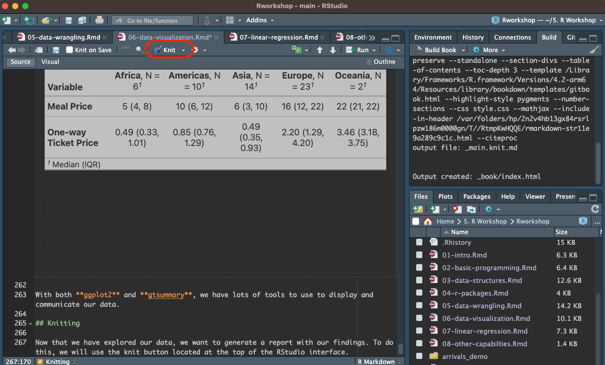
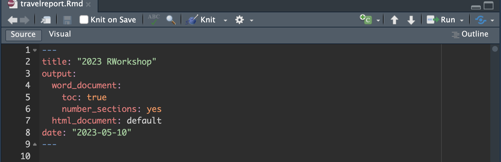

# Data visualization

Another way we can represent our insights is through data visualization through different graphs. Visualizations can be important tool in exploratory data analysis for identify patterns in our data. Creating meaningful visualization can help communicate your findings and ideas to a wide audience. 

## Plots 

There a few basic plots that can be used for exploratory analysis. In R, we can build most plots using the base R but we will also be exploring a package called **ggplot2**. We will use the display the previous summary statistics using:

* Boxplots

* Histograms

* Scatterplots

### Boxplots

Boxplots are used to summarize the same 5 number summary as the **summary( )** function. They are also a great way to quickly detect outliers in your dataset. To create a basic boxplot with base R, we can use the **boxplot( )** function.

```{r boxplot meals base}
boxplot(travel_full_clean_subset$Meal_Inexpensive_Restaurant)
```

With the basic boxplot we can quickly see that no outliers are present in our data and that our data is slight right skewed with the median is below the center of the boxplot. To label our boxplot, we can add the following arguments.

```{r boxplot with labels base}
boxplot(travel_full_clean_subset$Meal_Inexpensive_Restaurant,
        main = "Average price of resturant meals", # Title of the graph
        xlab = "", # x-axis label
        ylab= "Dollar amount (CAD)", # y-axis label
        col = "white") # color of the boxplot
```

### Histogram

Histograms can show the how our data is distributed. We can use the **hist( )** function to do this.

```{r distribution of cost base}
hist(travel_full_clean_subset$Meal_Inexpensive_Restaurant, 
     breaks= 30, # number of breaks 
     ylim = c(0,6),
     main = "Distribution of Average meal cost (CAD)",
     xlab = "") # y-axis limit

```

### Scatterplots

Scatterplots are useful to show a relationship between two different variables. For example, we can plot the the arrivals over time. Let's examine how Finland has changed over time. There are a few steps we need to take 

* Filter our dataset to show data for Finland

* Select the columns related to arrival (1995-2020)

* Pivot our data from wide format to long format 

* Rename our columns to meaningful columns

* Draw the scatterplot

We will be using the `gather( )` function that is part of the `tidyr` package. This package helps us convert between different data formats. 

<h3> Note </h3>

> tidyr and dplyr are both part of the tidyverse set of packages. You can install both by using `install.packages('tidyverse') and load then with library(tidyverse)

```{r scatterplot subset base}
library(tidyr)
sweden_travel <- travel_full_clean_subset %>%
  filter(country_code=="SWE" ) %>%
  select(c("1995":"2020")) %>%
  gather() %>% # pivots the data
  rename(years= key,
         arrivals= value)
```

Take note of the data types for each of the columns. Our years column are characters but we want to change that to a numerical format. To do this, we can use the `as.numeric ()` function on the specific column 

```{r convert datatypes}
sweden_travel$years <-as.numeric(sweden_travel$years)
```

```{r Sweden scatterplot}
plot(sweden_travel$years, sweden_travel$arrivals/100000,
     main="Number of Travellers from 1995 to 2020 (Sweden)",
     xlab="Years",
     ylab="Number of arrivals (x100,000)") 
```


From the scatterplot, we see a steady increase in arrivals to sweeden over the years. We do see a few years between 2010, and 2015 with a high spike in arrivals which could indicate a few outliers in our data. To check we can run another boxplot on the arrivals data.

```{r boxplot arrival base}
boxplot(sweden_travel$arrivals/100000,
        main = "Number of arrivals from 1995 - 2020 (Sweden)", # Title of the graph
        xlab = "", # x-axis label
        ylab= "Number of arrivals (x100,000)", # y-axis label
        col = "white") # color of the boxplot)
```

From the boxplot, we can see that there is at least 1 point that is an outlier in the data indicated by the circle above the maximum value

## ggplot2

You can use the **ggplot2** package to create plots and figures instead of using the base R. It gives you more control over your plots to specify how you want it to look. Let's remake the previous 3 plots using **ggplot2**

<h3> Note </h3>

> You can refer to the **ggplot2** <https://ggplot2.tidyverse.org/reference/index.html> to find all the possible plots that you can build with ggplot2

First, we will need to install the package and then load the pack using the **library( )** function. 

```{r loading packages ggplot2, results='hide', warning= FALSE}
library(ggplot2)
```

### Boxplot

The basic structure for using **ggplot( )** is

**ggplot(data = x, aes(x = x-axis, y = y-axis)) + geom_typeOfPlot() **

where *aes* stands for aesthetic. This defines what variables you want to plot. For our boxplot, we want look at the meal prices as a whole so we only need to declare the y-variable. 

```{r boxplot ggplot2}
ggplot(data = travel_full_clean_subset, aes(y=Meal_Inexpensive_Restaurant)) + 
  geom_boxplot()
```

We can also rename our axis in a simliar way to our base R plot by using the **labs( )** argument.

```{r boxplot ggplot2 clean}
ggplot(data = travel_full_clean_subset, aes(y=Meal_Inexpensive_Restaurant)) + 
  geom_boxplot() +
  labs(title="Average price of resturant meals",
       x="", 
       y = "Dollar amount (CAD)")
```
 
From here, we can customize the look of our boxplot with other arguments. 

### Histogram

We can do the same with our histogram. Instead of using **geom_boxplot( )** we will use **geom_histogram( )**

```{r distribution of cost ggplot2}
ggplot(data = travel_full_clean_subset, aes(x=Meal_Inexpensive_Restaurant)) + 
  geom_histogram(bins=30) +
  labs(title="Distribution of Average meal cost (CAD)",
       y= "Frequency",
       x="")
```

### Scatterplot

Similarly with the scatterplot, we can use **geom_point( )**
```{r scatter ggplot2 base}
ggplot(data = sweden_travel, aes(x=years, y = arrivals/100000)) + 
  geom_point() +
  labs(title="Number of Travellers from 1995 to 2020 (Sweden)",
     x="Years",
     y="Number of arrivals (x100,000)")
```

We can see that the scatterplot has the same trend but looks a little different. We can easily adjust the graph so it matches our previous one.

```{r scatter ggplot2 clean}
ggplot(data = sweden_travel, aes(x=years, y = arrivals/100000)) + 
  geom_point(shape=1,
             size=2) +
  labs(title="Number of Travellers from 1995 to 2020 (Sweden)",
     x="Years",
     y="Number of arrivals (x100,000)")+
  scale_x_discrete(guide = guide_axis(check.overlap = TRUE)) +
  theme_classic()
```

By adding a few arguments we can create clean and meaningful graphs using **ggplot2**

```{r boxplot travel outlier ggplot2}
ggplot(data = sweden_travel, aes(y=arrivals/100000)) + 
  geom_boxplot(outlier.color = "red", outlier.shape = 1, outlier.size = 3) +
  labs(title="Number of Travellers from 1995 to 2020 (Sweden)",
       x="", 
       y = "Arrivals")
```

### Exporting plots 

Once you are finished with creating your desired graph, you can export the file as a pdf or other vector image formats for journals. Let's use our last boxplot on the number of arrivals as a example. First we need to save the boxplot as a variable. 

```{r arrival Sweden boxplot}
boxplot_arrivals_swe <- ggplot(data = sweden_travel, aes(y=arrivals/100000)) + 
  geom_boxplot(outlier.color = "red", outlier.shape = 1, outlier.size = 3) +
  labs(title="Number of Travellers from 1995 to 2020 (Sweden)",
       x="", 
       y = "Arrivals")
```

Next, we will use the **ggsave( )** function and specify the location, the format, and the height and width we want to save the image as.

```{r saving files}
ggsave("/Users/markly/boxplot_swe_arrival.pdf", plot = boxplot_arrivals_swe, device = "pdf", width = 12, height = 6, dpi=150)
```

<h3> Note: </h3>

> We can save images in different formats including 

* png, eps, ps, tex, jpeg, tiff, bmp, svg or wmf

## gtsummary

Another powerful package that helps with data visulizuation is **gtsummary** which can quickly generate summary tables. We will need to install the package and load the package using the **library( )** function.

```{r loading packages gtsummary, results='hide', warning= FALSE}
library(gtsummary)
```

<h2> Try </h2>

> Try installing the **gtsummary** package

Let's say we are interested in summarizing the meal and ticket costs in a table. First, we will need to subset that from our dataset and then pass that into the **tbl_summary( )** function.

```{r base gtsummary}
travel_full_clean_subset %>%
  select(c(Meal_Inexpensive_Restaurant,one_way_ticket_local)) %>%
  tbl_summary()
```

This produced a summary table of all the meals and ticket information giving us the **median** and **IQR** without any additional steps. We can customize this table a bit further by adding a few arguments.

```{r base gtsummary clean}
travel_full_clean_subset %>%
  select(c(Meal_Inexpensive_Restaurant,one_way_ticket_local)) %>%
  tbl_summary(label = list("Meal_Inexpensive_Restaurant"~"Meal Price",
                           "one_way_ticket_local"~"One-way Ticket Price")) %>%
  modify_header(label = "**Variable**") %>% # update the column header
  bold_labels() 
```

**gtsummary** is also great for separating and summarizing groups in the same table. We can add region information to our data set using a left join. After saving our new dataframe, we can select only the variables needed, region, meal price, and ticket price, and apply the **gtsummary( )** function to output a table based on region.

```{r region gtsummary}
region<- read.csv("data/csv_region.csv")
region_select <-region %>%
  select(c(alpha.3,region)) %>%
  rename(country_code = alpha.3)

travel_region <- travel_full_clean_subset %>%
  select(c(1:4)) %>%
  inner_join(.,region_select,by="country_code")

travel_region %>% 
  select(-c(Country,country_code))%>%
  tbl_summary(by=region,
              label = list("Meal_Inexpensive_Restaurant"~"Meal Price",
                           "one_way_ticket_local"~"One-way Ticket Price")) %>%
  modify_header(label = "**Variable**") %>% # update the column header
  bold_labels()
```

With both **ggplot2** and **gtsummary**, we have lots of tools to use to display and communicate our data.  

## Knitting

Now that we have explored our data, we want to generate a report with our findings. To do this, we will use the knit button located at the top of the RStudio interface. 

```{r fig.cap=paste("knit button"), fig.width=5, fig.height=5, echo=FALSE}

``` 

Before, we start we should save our work. Select the `knit to word` option and wait for the file to compile. 

We can adjust how the word file at the top of the rmd file. Once the word file is generated, we can make adjustments to tables, text and, figures.

```{r fig.cap=paste("adjust document"), fig.width=5, fig.height=5, echo=FALSE}

``` 
