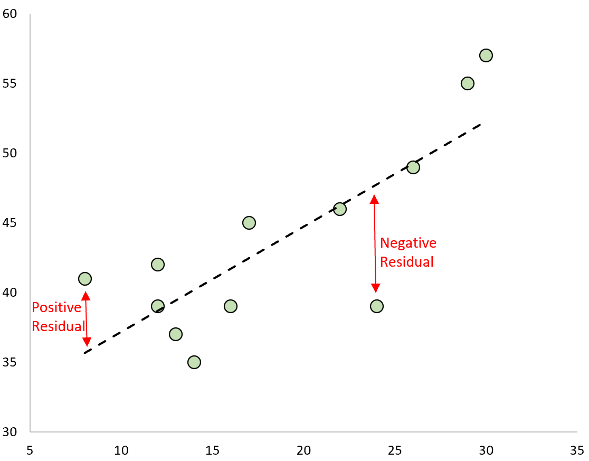

# Regression

R is a statistical computing language which is capable of performing multiple statistical models including

* lm(y ~ x) linear regression model with one explanatory variable

* lm(y ~ x1 + x2 + x3) multiple regression, a linear model with multiple explanatory variables

* glm(y ~ x, family = poisson) generalized linear model, poisson distribution; see ?family to see those supported, including binomial, gaussian, poisson, etc.

* glm(y ~ x + y, family = binomial) glm for logistic regression

* aov(y ~ x) analysis of variance (same as lm except in the summary)

* gam(y ~ x) generalized additive models

* tree(y ~ x) or rpart(y ~ x) regression/classification trees

## Linear regression

Linear regression is a statistical method used for predictive analysis where we want to show if there is a linear relationship between an **independent predictor** variable and a **dependent output** variable. The goal is to build a mathematical formula that defines y as a function of the x variable. Once, we built a statistically significant model, it’s possible to use it for predicting future outcome on the basis of new x values.

From the previous scatterplot, we noticed that there might be a relationship between the years and arrivals for Sweden. We can try to perform a linear regression to determine if that is the case. The hypothesis we want to propose is that the number of arrivals to Sweden increases linearly per year. 

The general formula for a linear model is 

$$Y_{i} = \beta_{0} + \beta_{1}X_{1} + \epsilon $$
where 

$$Y_{i} = \text{Dependent Variable}$$
$$\beta_{0} = \text{Constant/Intercept}$$
$$\beta_{1} = \text{Slope/Intercept}$$
$$X_{1} = \text{Independent Variable}$$
$$\epsilon = \text{Error Term}$$

For our model, we would write out our linear regression equation as 

$$\text{arrivals} = \beta_{0} + \beta_{1}*\text{Years} + \epsilon$$

### Assumptions of Linear Regression

Before we begin with linear regression, there are some assumptions that need to be satisfied. We can use the `LINE` acronym to explain these assumptions.

* **L**inearity of residuals - There needs to be a linear relationship between the dependent and independent variables(s)

* **I**ndependance of residuals - The error terms should not be dependent on one another. For example, in time series, the next value is dependent on the previous one. 

* **N**ormal distribution of residuals - The mean residuals should follow a normal distribution with a mean equal to zero or close to zero. 

* **E**qual variance of the residuals - The error terms must have constant variance

### Residuals 

Residuals represent the difference between the predicted value and the observed value. The formula for residuals is. 

$$\text{Residual} - \text{actual y value} - \text{predicted y value}$$
This is what residuals look like on a linear regression plot. 

```{r fig.cap=paste("Residuals on a linear regression"), echo=FALSE}

```

### Creating our intial model 

To create a linear model, we use this function when we have one explanatory variable

> **lm([target] ~ [predictor / features], data = [data source])**

In this case our y-variable is the number of `arrivals` and the x-variable is the `years`

<h3> Note: </h3>

> The years variable in our dataframe is a *character*. We need to convert it to a numeric to perform the linear regression.

```{r linear model}
swe_model <- lm(arrivals~years,data=sweden_travel)
swe_model
```


### Interpretation of results

We can print out a summary of our model using the **summary( )** function. This will give us information on the intercept, standard error, p-value, test-statistic, $r^2$ value.

```{r lm summary}
summary(swe_model)
```

In this output, the estimate column shows the estimates of our beta coefficients $\beta_0$ and $\beta_1$.
The intercept ($\beta_0$) is -470,402,333 and the coefficient of years variable is 237,113. We can rewrite our original equation with our new results 

$$\text{arrivals} = \beta_{0} + \beta_{1}*\text{Years} + \epsilon$$
$$\text{arrivals} = -470,402,333 + 237,113*\text{Years} + \epsilon$$
In writen form, we would say 

* If the Years is equal to zero, we can expect -470,402,333 arrivals 

* For every 1 increase in Years, we can expect 237,113 arrivals 

The first point doesn't make any sense since we can't have year equal to 0. 

### Assumption checking

If we plot our linear regression, it will give us diagnostic plots that will help determine if our linear model satisfies certain assumptions 

* **Residual vs Fitted** - Used to check linear relationship assumptions. 

* **Normal Q-Q**- Used to check if the residuals are normally distributed.

* **Scale-Location** - Used to check homogeneity of variance. 

* **Residuals vs Leverage** - Used to check for influential cases or extreme values that might influence the regression results.

```{r lm resdiual vs fitted plots}
plot(swe_model,which=(1))
```

If our linearity assumption is met, we should see no pattern and the red line show be fairly flat. In our model, we see that this is the case with a few points cluster of points that lie above the line.

```{r lm normal q-q plots}
plot(swe_model,which=(2))
```

For our normality assumption we can use the second plot, the Normal Q-Q plot. what we expect to see is a 45 degree line and most of the points should lie on this line. For our model this does not seem to hold true as our points are closer to a 10-20 degree slope. 

```{r lm scale-location plots}
plot(swe_model,which=(3))
```

To check our assumption of constant variance we can use the third plot, the scale-location plot. What we want to see here are points scattered randomly and the red line to be close to horizontal. However, what we see is there is a pattern and that indicates that the constant variance assumption does not hold true for this model. What we can try to do is transform our y variable using:

* Log transformation

* Square Root transformation

* Cube Root transformation


```{r lm leverage}
par(mfrow=c(1,2))
plot(swe_model, which=c(4,5))
```

The last plot is the Residuals vs leverage plot. Leverage refers to to the extent where our coefficients would change if we removed an observation from the data set. Points that have high leverage would noticeably change our coefficients. If a point falls outside of the red dashed line, cook's distance, it is considered to be a influential point and requires further investigation. For our model, we don't have any points that are influential.

### Summary

Our initial hypothesis was 

> Does the number of arrivals increase linearly over time (Years)?

Since this model does not satisfy the normality assumption and the constant variance assumption that is required for linear regression, we cannot say that the number of arrivals increases linearly as years increases. 

### Next steps

Since our linear regression model did not work, we can try using a different model that might be better in explaining trend. In this case, our independent variable is the number of arrivals which count data. Count data is data that does not contain any non-negative integer numbers, (0,1,2,3...). The usual function to deal with count data is a `Poisson Regression`, which is a generalized linear model used when the independent variable deals with count data that follows a Poisson distribution. It assumes the logarithm of expected values (mean) that can be modeled into a linear form by some unknown parameters.


